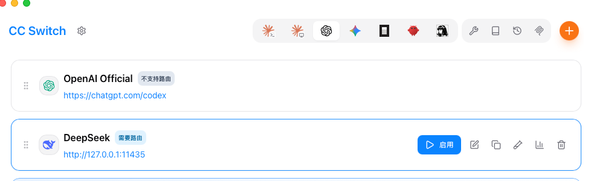
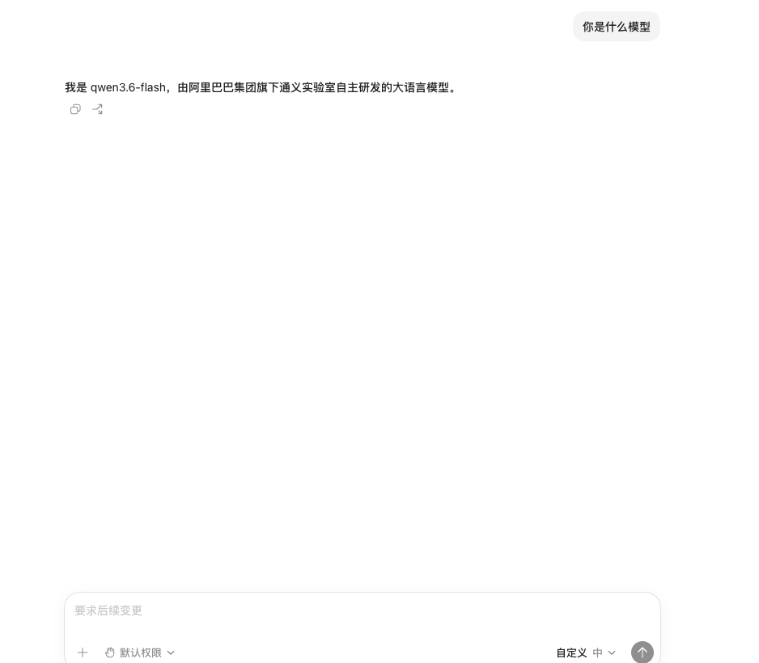

# codex-switch-anymodel

[English](README_EN.md) | [中文](README.md)

---

将任意 **Chat Completions API** 兼容的模型转换为 **OpenAI Responses API**，让 **Codex**（VS Code AI 编程助手）可以使用任意大语言模型。

## 📖 简介

**Codex** 是 VS Code 中的 AI 编程助手（GitHub Copilot 的一部分），它使用 OpenAI 最新的 **Responses API**（`v1/responses`）协议。而绝大多数大模型厂商（DeepSeek、通义千问、GLM、Claude 等）仅提供标准的 **Chat Completions API**（`v1/chat/completions`）或 OpenAI 兼容接口，无法直接接入 Codex。

本项目在本地启动一个协议翻译代理，无缝地在两者之间转换：

```
Codex (VS Code)                 codex-switch-anymodel                    上游 API
┌──────────┐    Responses API   ┌────────────────┐   Chat Completions API  ┌──────────┐
│          │ ──────────────────▶│                │ ──────────────────────▶│          │
│  Codex   │                    │  本地代理服务   │                        │  DeepSeek │
│ (VS Code)│◀──────────────────│                │◀──────────────────────│  通义千问  │
│          │    Responses API   │  port: 11435   │   Chat Completions API │   GLM    │
└──────────┘                    └────────────────┘                        └──────────┘
```

## 🚀 使用流程

整个使用流程分为三步：

```
1. 配置 .env（填入上游 API 密钥和模型）
          ↓
2. 启动本代理服务
          ↓
3. 在 CC Switch 中添加自定义配置
          ↓
4. 重启codex，即可使用自定义模型
```





---

## 🚀 快速开始

### 前置要求

- Python >= 3.10
- VS Code（已安装 GitHub Copilot / Codex 扩展）

### 1. 安装

```bash
# 克隆仓库
git clone https://github.com/your-username/codex-switch-anymodel.git
cd codex-switch-anymodel

# 安装依赖
pip install -e .
```

### 2. 配置上游 API

复制环境变量模板并编辑：

```bash
cp .env_example .env
```

编辑 `.env` 文件，填入你想要使用的上游模型信息：

```ini
# 上游 API 密钥（以 DeepSeek 为例）
api_key=sk-your-deepseek-api-key

# 上游 API 地址
base_url=https://api.deepseek.com

# 默认模型
model=deepseek-chat

# 本地代理端口
port=11435
```

> **切换其他模型**：只需修改 `base_url` 和 `model` 即可切换到其他提供商，例如：
> - **通义千问 Qwen**：`base_url=https://dashscope.aliyuncs.com/compatible-mode/v1`，`model=qwen-plus`
> - **智谱 GLM**：`base_url=https://open.bigmodel.cn/api/paas/v4`，`model=glm-4-flash`

### 3. 启动代理服务

```bash
# 方式一：直接启动
codex-switch

# 方式二：使用 Python 模块
python -m src.main

# 方式三：使用 uvicorn
uvicorn src.main:app --host 127.0.0.1 --port 11435
```

启动成功后，终端会显示：

```
[ OK     ] codex-switch-anymodel starting...
[INFO    ] listen: http://127.0.0.1:11435/v1/responses
[INFO    ] model: deepseek-chat
[INFO    ] upstream: https://api.deepseek.com
```

### 4. 配置 VS Code 中的 Codex

#### 方法一：VS Code 设置界面（推荐）

1. 打开 VS Code
2. 进入设置（`Cmd + ,` 或 `Ctrl + ,`）
3. 搜索 `codex` 或 `github.copilot`
4. 找到以下设置项并修改：

| 设置项 | 值 |
|--------|-----|
| `codex.apiBase` 或 `github.copilot.codex.apiBase` | `http://127.0.0.1:11435` |
| `codex.apiKey` 或 `github.copilot.codex.apiKey` | `not-needed` |

#### 方法二：VS Code settings.json

在 VS Code 的 `settings.json` 中添加：

```json
{
  "codex.apiBase": "http://127.0.0.1:11435",
  "codex.apiKey": "not-needed"
}
```

#### 方法三：环境变量

```bash
export CODEX_API_BASE=http://127.0.0.1:11435
export CODEX_API_KEY=not-needed
```

> **注意**：不同版本的 Codex / Copilot 设置项名称可能略有差异，请以你的 VS Code 中实际显示的为准。关键是将 API Base URL 指向 `http://127.0.0.1:11435`。

### 5. 验证

配置完成后，在 VS Code 中打开 Codex 聊天窗口，发送一条消息。本代理的终端会打印出请求日志：

```
[REQUEST ] thinking:off msgs:2 stream:true | 你好
[INFO    ] SSE start: resp_xxxxxx
[RESPONSE] text output: 65 chars
[ OK     ] SSE done: resp_xxxxxx
```

---

## ✨ 功能

- **协议翻译**：将 Responses API 请求完整转换为 Chat Completions API
- **流式支持**：SSE 事件实时翻译，支持 `output_text.delta`、`reasoning_text.delta`、`function_call_arguments.delta`
- **非流式支持**：同时支持流式和非流式两种模式
- **工具调用**：`function_call` / `function_call_output` ↔ assistant `tool_calls` / `tool` message
- **推理内容**：`reasoning_content` 完整保留，跨轮次自动记忆与补回
- **思考模式**：支持 `thinking` / `reasoning` 参数透传
- **参数透传**：`temperature`、`top_p`、`max_output_tokens`、`tools`、`tool_choice`
- **多模态标记**：`input_image` / `input_file` / `input_audio` 跳过统计
- **精细日志**：loguru 驱动，彩色控制台 + 文件轮转，区分 REQUEST / RESPONSE / TOKS
- **灵活配置**：.env 文件 + 环境变量，支持任意上游 API

## 🔧 配置详解

所有配置项均支持 `.env` 文件和环境变量两种方式。

| 配置项 | 默认值 | 说明 |
|--------|--------|------|
| `api_key` | `""` | 上游 API 密钥 |
| `base_url` | `https://api.deepseek.com` | 上游 API 基础地址 |
| `model` | `deepseek-chat` | 默认模型（当客户端未指定时使用） |
| `host` | `127.0.0.1` | 本地监听地址 |
| `port` | `11435` | 本地监听端口 |
| `log_level` | `INFO` | 日志级别 |
| `log_file` | `logs/proxy.log` | 日志文件路径 |
| `log_retention` | `30 days` | 日志保留时间 |
| `request_timeout` | `300` | 上游请求超时（秒） |

### 自定义模型身份提示

在 `.env` 中设置 `default_instructions` 可以自定义系统提示词：

```ini
default_instructions=You are a helpful assistant powered by an open-source model.
```

## 📁 项目结构

```
codex-switch-anymodel/
├── src/
│   ├── __init__.py           # 包初始化
│   ├── main.py               # 入口点（uvicorn）
│   ├── app.py                # Starlette 应用（路由处理）
│   ├── config.py             # 配置管理（pydantic-settings）
│   ├── models/
│   │   ├── __init__.py
│   │   ├── responses.py      # Responses API 数据模型
│   │   └── chat.py           # Chat Completions API 数据模型
│   ├── translator/
│   │   ├── __init__.py
│   │   ├── input_translator.py   # 输入翻译: Responses → Chat
│   │   ├── output_translator.py  # 输出翻译: Chat → Responses（非流式）
│   │   └── sse_translator.py     # SSE 事件翻译: Chat → Responses（流式）
│   ├── core/
│   │   ├── __init__.py
│   │   ├── upstream.py           # 上游 API 客户端（httpx）
│   │   └── reasoning_recovery.py # reasoning_content 自动记忆与补回
│   └── utils/
│       ├── __init__.py
│       └── logger.py             # 日志系统（loguru）
├── .env_example              # 环境变量模板
├── .gitignore
├── pyproject.toml             # 项目配置与依赖
├── README.md                 # 本文件
└── README_EN.md              # English README
```

## 🔄 协议翻译覆盖

### 输入（Responses API → Chat Completions）

| Responses API | Chat Completions API |
|---|---|
| `input` (string/array) | `messages` |
| role-based items (`user`/`assistant`/`system`) | `messages[]` |
| `developer` role | `system` role |
| `function_call` item | `assistant` message + `tool_calls` |
| `function_call_output` item | `tool` message |
| `reasoning` item | 跳过，保留 `reasoning_content` |
| `message` item | `user` message |
| `instructions` | `system` message (首条) |
| `input_image` / `input_file` / `input_audio` | 跳过并统计 |
| `tools[]` | `tools[]` |
| `tool_choice` | `tool_choice` |
| `thinking` / `reasoning` | `thinking` 参数 + `extra_body` |
| `temperature` / `top_p` | `temperature` / `top_p` |
| `max_output_tokens` | `max_tokens` |

### 输出（Chat Completions → Responses API）

| Chat Completions API | Responses API SSE 事件 |
|---|---|
| (响应开始) | `response.created` → `response.in_progress` |
| `delta.content` | `response.output_item.added` → `response.content_part.added` → `response.output_text.delta` |
| `delta.reasoning_content` | `response.output_item.added` → `response.content_part.added` → `response.reasoning_text.delta` |
| `delta.tool_calls` | `response.output_item.added` → `response.function_call_arguments.delta` |
| (流结束) | `response.content_part.done` → `response.output_text.done` / `response.reasoning_text.done` / `response.function_call_arguments.done` → `response.output_item.done` → `response.completed` |
| `usage` | `response.completed` 中携带 `usage` 字段 |

## 🧪 测试

```bash
# 运行所有测试
pytest tests/

# 运行特定测试
pytest tests/test_input_translator.py -v
```

## 📝 日志

日志同时输出到控制台和文件：

**控制台**（彩色）：

```
[REQUEST ] 14:30:00 | input msgs:5 | 帮我写一个 Python 程序...
[RESPONSE] 14:30:05 | text output: 324 chars
[TOKS    ] 14:30:05 | in:150 out:324 total:474
```

**文件**（logs/proxy.log，自动轮转压缩）：

```
[INFO    ] 2025-01-01 14:30:00.123 | 12345:12345 | input msgs:5 | 帮我写一个 Python 程序...
[RESPONSE] 2025-01-01 14:30:05.456 | 12345:12345 | text output: 324 chars
[TOKS    ] 2025-01-01 14:30:05.789 | 12345:12345 | in:150 out:324 total:474
```

## ⚠️ 注意事项

- 本代理仅支持 **文本** 和 **函数调用**，多模态内容（图片/文件/音频）会被跳过并统计
- 某些模型不支持 `thinking` 参数，此时会自动降级
- 建议在上游 API 中开启 `thinking` 模式以获得更好的推理内容体验

## 🤝 贡献

欢迎提交 Issue 和 Pull Request！

## 📄 License

MIT License - 详见 [LICENSE](LICENSE) 文件。

## 🙏 致谢

- 使用 [Starlette](https://www.starlette.io/) 作为 Web 框架
- 使用 [httpx](https://www.python-httpx.org/) 作为异步 HTTP 客户端
- 使用 [loguru](https://loguru.readthedocs.io/) 作为日志库