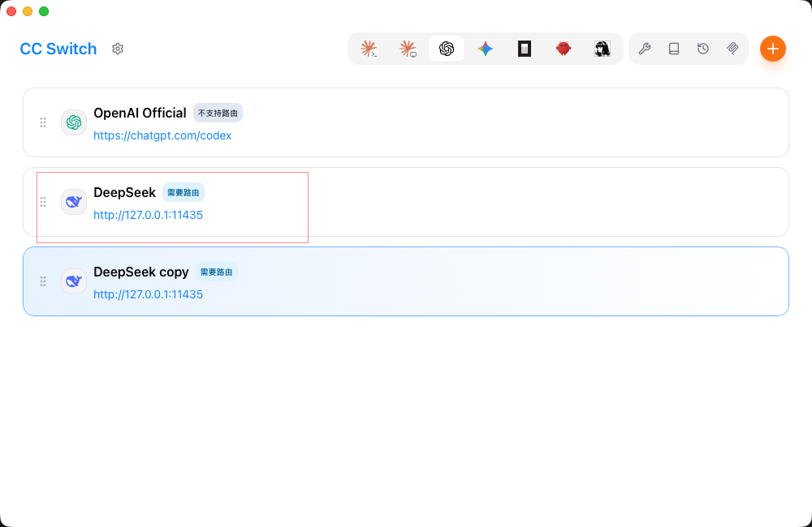
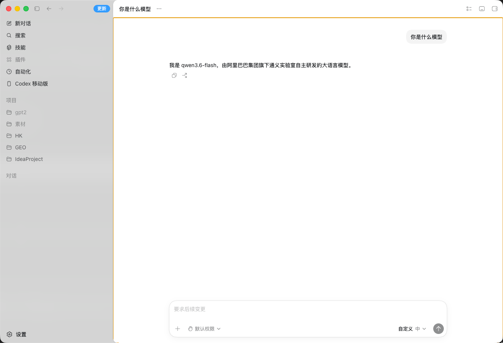

# codex-switch-anymodel

[English](README_EN.md) | [中文](README.md)

---

Convert any **Chat Completions API** compatible model to **OpenAI Responses API**, enabling **Codex** (VS Code AI coding assistant) to use any large language model.

## 📖 Introduction

**Codex** is the AI coding assistant in VS Code (part of GitHub Copilot), which uses OpenAI's latest **Responses API** (`v1/responses`) protocol. However, most LLM providers (DeepSeek, Qwen, GLM, Claude, etc.) only offer the standard **Chat Completions API** (`v1/chat/completions`) or OpenAI-compatible endpoints, which cannot be directly used by Codex.

This project runs a protocol translation proxy locally, bridging the gap seamlessly:

```
Codex (VS Code)                 codex-switch-anymodel                    Upstream API
┌──────────┐    Responses API   ┌────────────────┐   Chat Completions API  ┌──────────┐
│          │ ──────────────────▶│                │ ──────────────────────▶│          │
│  Codex   │                    │  Local Proxy   │                        │  DeepSeek │
│ (VS Code)│◀──────────────────│                │◀──────────────────────│   Qwen    │
│          │    Responses API   │  port: 11435   │   Chat Completions API │   GLM     │
└──────────┘                    └────────────────┘                        └──────────┘
```

## 🚀 Workflow

The complete setup consists of four simple steps:

```
1. Configure .env (enter your upstream API key and model)
          ↓
2. Start the proxy service
          ↓
3. Add custom configuration in CC Switch
          ↓
4. Restart Codex, and you can use your custom model
```





---

## 🚀 Quick Start

### Prerequisites

- Python >= 3.10
- VS Code (with GitHub Copilot / Codex extension installed)

### 1. Install

```bash
# Clone the repository
git clone https://github.com/your-username/codex-switch-anymodel.git
cd codex-switch-anymodel

# Install dependencies
pip install -e .
```

### 2. Configure Upstream API

Copy the environment template and edit:

```bash
cp .env_example .env
```

Edit `.env` with your upstream model information:

```ini
# Upstream API key (e.g., DeepSeek)
api_key=sk-your-deepseek-api-key

# Upstream API base URL
base_url=https://api.deepseek.com

# Default model name
model=deepseek-chat

# Local proxy port
port=11435
```

> **Switching models**: Just change `base_url` and `model` to use a different provider:
> - **Qwen (Tongyi Qianwen)**: `base_url=https://dashscope.aliyuncs.com/compatible-mode/v1`, `model=qwen-plus`
> - **GLM (Zhipu AI)**: `base_url=https://open.bigmodel.cn/api/paas/v4`, `model=glm-4-flash`

### 3. Start the Proxy

```bash
# Option 1: Direct start
codex-switch

# Option 2: Python module
python -m src.main

# Option 3: uvicorn
uvicorn src.main:app --host 127.0.0.1 --port 11435
```

Successful startup output:

```
[ OK     ] codex-switch-anymodel starting...
[INFO    ] listen: http://127.0.0.1:11435/v1/responses
[INFO    ] model: deepseek-chat
[INFO    ] upstream: https://api.deepseek.com
```

### 4. Configure Codex in VS Code

#### Method 1: VS Code Settings UI (Recommended)

1. Open VS Code
2. Go to Settings (`Cmd + ,` or `Ctrl + ,`)
3. Search for `codex` or `github.copilot`
4. Find and modify:

| Setting | Value |
|---------|-------|
| `codex.apiBase` or `github.copilot.codex.apiBase` | `http://127.0.0.1:11435` |
| `codex.apiKey` or `github.copilot.codex.apiKey` | `not-needed` |

#### Method 2: VS Code settings.json

Add to your VS Code `settings.json`:

```json
{
  "codex.apiBase": "http://127.0.0.1:11435",
  "codex.apiKey": "not-needed"
}
```

#### Method 3: Environment Variables

```bash
export CODEX_API_BASE=http://127.0.0.1:11435
export CODEX_API_KEY=not-needed
```

> **Note**: The exact setting names may vary slightly depending on your Codex/Copilot version. The key point is to set the API Base URL to `http://127.0.0.1:11435`.

### 5. Verify

Open the Codex chat panel in VS Code and send a message. The proxy terminal will show request logs:

```
[REQUEST ] thinking:off msgs:2 stream:true | Hello
[INFO    ] SSE start: resp_xxxxxx
[RESPONSE] text output: 65 chars
[ OK     ] SSE done: resp_xxxxxx
```

---

## ✨ Features

- **Protocol Translation**: Full conversion from Responses API to Chat Completions API
- **Streaming Support**: Real-time SSE event translation with `output_text.delta`, `reasoning_text.delta`, `function_call_arguments.delta`
- **Non-streaming Support**: Both streaming and non-streaming modes supported
- **Tool Calling**: `function_call` / `function_call_output` ↔ assistant `tool_calls` / `tool` message
- **Reasoning Content**: Full `reasoning_content` preservation with cross-turn auto-recovery
- **Thinking Mode**: `thinking` / `reasoning` parameter passthrough
- **Parameter Passthrough**: `temperature`, `top_p`, `max_output_tokens`, `tools`, `tool_choice`
- **Multimodal Tracking**: `input_image` / `input_file` / `input_audio` skip & count
- **Fine-grained Logging**: loguru-powered, colored console + file rotation, REQUEST / RESPONSE / TOKS levels
- **Flexible Configuration**: .env file + environment variables, works with any upstream API

## 🔧 Configuration

All settings support both `.env` file and environment variables.

| Setting | Default | Description |
|---------|---------|-------------|
| `api_key` | `""` | Upstream API key |
| `base_url` | `https://api.deepseek.com` | Upstream API base URL |
| `model` | `deepseek-chat` | Default model name |
| `host` | `127.0.0.1` | Local listen address |
| `port` | `11435` | Local listen port |
| `log_level` | `INFO` | Log level |
| `log_file` | `logs/proxy.log` | Log file path |
| `log_retention` | `30 days` | Log retention period |
| `request_timeout` | `300` | Upstream request timeout (seconds) |

### Custom Model Identity

Set `default_instructions` in `.env` to customize system prompt:

```ini
default_instructions=You are a helpful assistant powered by an open-source model.
```

## 📁 Project Structure

```
codex-switch-anymodel/
├── src/
│   ├── __init__.py           # Package init
│   ├── main.py               # Entry point (uvicorn)
│   ├── app.py                # Starlette application
│   ├── config.py             # Configuration (pydantic-settings)
│   ├── models/
│   │   ├── __init__.py
│   │   ├── responses.py      # Responses API data models
│   │   └── chat.py           # Chat Completions API data models
│   ├── translator/
│   │   ├── init__.py
│   │   ├── input_translator.py   # Input: Responses → Chat
│   │   ├── output_translator.py  # Output: Chat → Responses (non-stream)
│   │   └── sse_translator.py     # SSE: Chat → Responses (stream)
│   ├── core/
│   │   ├── __init__.py
│   │   ├── upstream.py           # Upstream API client (httpx)
│   │   └── reasoning_recovery.py # Content auto-recovery
│   └── utils/
│       ├── __init__.py
│       └── logger.py             # Logging (loguru)
├── .env_example              # Environment template
├── .gitignore
├── pyproject.toml             # Project configuration
├── README.md                 # Chinese README
└── README_EN.md              # This file
```

## 🔄 Protocol Translation Coverage

### Input (Responses API → Chat Completions)

| Responses API | Chat Completions API |
|---|---|
| `input` (string/array) | `messages` |
| role-based items (`user`/`assistant`/`system`) | `messages[]` |
| `developer` role | `system` role |
| `function_call` item | `assistant` message + `tool_calls` |
| `function_call_output` item | `tool` message |
| `reasoning` item | Skip, preserve `reasoning_content` |
| `message` item | `user` message |
| `instructions` | `system` message (first) |
| `input_image` / `input_file` / `input_audio` | Skip & count |
| `tools[]` | `tools[]` |
| `tool_choice` | `tool_choice` |
| `thinking` / `reasoning` | `thinking` param + `extra_body` |
| `temperature` / `top_p` | `temperature` / `top_p` |
| `max_output_tokens` | `max_tokens` |

### Output (Chat Completions → Responses API)

| Chat Completions API | Responses API SSE Event |
|---|---|
| (Response start) | `response.created` → `response.in_progress` |
| `delta.content` | `response.output_item.added` → `response.content_part.added` → `response.output_text.delta` |
| `delta.reasoning_content` | `response.output_item.added` → `response.content_part.added` → `response.reasoning_text.delta` |
| `delta.tool_calls` | `response.output_item.added` → `response.function_call_arguments.delta` |
| (Stream end) | `response.content_part.done` → `response.output_text.done` / `response.reasoning_text.done` / `response.function_call_arguments.done` → `response.output_item.done` → `response.completed` |
| `usage` | `usage` field in `response.completed` |

## 🧪 Testing

```bash
# Run all tests
pytest tests/

# Run specific test
pytest tests/test_input_translator.py -v
```

## 📝 Logging

Logs to both console and file:

**Console** (colored):

```
[REQUEST ] 14:30:00 | input msgs:5 | Write a Python program...
[RESPONSE] 14:30:05 | text output: 324 chars
[TOKS    ] 14:30:05 | in:150 out:324 total:474
```

**File** (logs/proxy.log, auto-rotated & compressed):

```
[INFO    ] 2025-01-01 14:30:00.123 | 12345:12345 | input msgs:5 | Write a Python program...
[RESPONSE] 2025-01-01 14:30:05.456 | 12345:12345 | text output: 324 chars
[TOKS    ] 2025-01-01 14:30:05.789 | 12345:12345 | in:150 out:324 total:474
```

## ⚠️ Notes

- This proxy only supports **text** and **function calls**; multimodal content (images/files/audio) will be skipped and counted
- Some models do not support the `thinking` parameter; auto-degradation will occur
- Enable `thinking` mode on your upstream API for the best reasoning content experience

## 🤝 Contributing

Issues and Pull Requests are welcome!

## 📄 License

MIT License - see [LICENSE](LICENSE) file for details.

## 🙏 Acknowledgments

- Built with [Starlette](https://www.starlette.io/) web framework
- Powered by [httpx](https://www.python-httpx.org/) async HTTP client
- Logging by [loguru](https://loguru.readthedocs.io/)